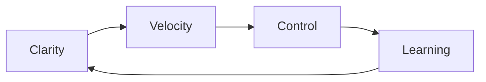
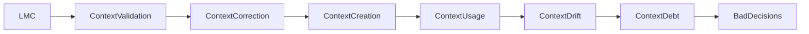

# LLM Maturity Cycle (LMC) — RFC

**Status:** Release Candidate (RC)
**Author:** Giuliano Gimenez
**Last Updated:** 2026

---

# Overview

This repository proposes the **LLM Maturity Cycle (LMC)** — a conceptual framework for **Context Engineering in AI-first software systems**.

The central idea is that the real impact of LLMs in software engineering is not simply faster code generation, but the ability to **structure, synthesize and evolve context across the engineering lifecycle**.

As AI agents become part of development workflows, engineering teams must learn how to **design, validate and evolve the context that those systems use to reason about software**.

This document presents the **Release Candidate (RC)** version of the LMC framework and is open to discussion, feedback and contributions.

---

# AI Won’t Fix Your Engineering Process

## But Context Engineering Might

*Why the real impact of LLMs in software engineering may not be writing code faster — but engineering the context that systems reason with.*

---

## Introduction — The problem is rarely speed

Many engineering teams eventually encounter the same challenge.

A large **monolithic service** grows over time until organizational changes require splitting responsibilities across multiple teams.

The question becomes inevitable:

**How do you break a monolith into multiple services without introducing even more complexity?**

Traditionally, this would involve weeks of architectural discussions, manual diagrams, and multiple iterations of migration plans.

Instead, we experimented with something different.

A language model agent analyzed the monolithic service and proposed an initial mapping of **domains and subdomains** based on code structure and business flows.

That mapping became an RFC.

After review and refinement by the engineering team, the same agent helped generate:

* the service decomposition strategy
* the migration plan
* the execution timeline
* backlog tasks for implementation

At that moment something became clear.

We were not just using AI to write code.

We were using AI to **reduce ambiguity before implementation even started**.

---

## The real bottleneck in software engineering

Most conversations about AI in software engineering focus on productivity.

* faster code generation
* automated test writing
* quicker feature delivery

These improvements are valuable.

But many engineering problems do not originate from slow implementation. They originate from **poorly defined problems**.

Examples include:

* ambiguous requirements
* implicit architectural decisions
* unclear domain boundaries
* unforeseen downstream impacts

The result is usually the same: **rework**.

> The problem is rarely speed.
> The problem is ambiguity.

Large language models are particularly good at **synthesizing context and exposing inconsistencies**, which leads to a new emerging discipline.

---

## Context Engineering

As LLM-powered systems become more sophisticated, a new concept has emerged: **Context Engineering**.

Context Engineering refers to the practice of **designing, structuring and evolving the context that AI systems use to reason**.

LLMs do not understand systems in the same way humans do. They operate entirely based on the context provided to them.

```
context → reasoning → output
```

If the context is wrong:

* reasoning will be wrong
* architecture suggestions will be wrong
* generated code will be wrong

> LLMs are not only model-bound.
> They are context-bound.

---

## The hidden risk: Context Debt

Just as traditional systems accumulate **Technical Debt**, AI-driven systems can accumulate **Context Debt**.

Context Debt occurs when the knowledge feeding AI systems becomes misaligned with the actual state of the software.

Examples include:

* outdated RFCs
* undocumented architectural decisions
* prompts based on obsolete assumptions
* business rules that evolved but were never reflected in system context

> Technical debt makes software harder to maintain.
> Context debt makes AI systems harder to trust.

---

## The LLM Maturity Cycle

During experimentation with AI-assisted workflows, a recurring pattern emerged.

This pattern became the **LLM Maturity Cycle (LMC)**.

The LMC organizes engineering processes into four forces:

* **Clarity** — creating context
* **Velocity** — applying context
* **Control** — validating context
* **Learning** — evolving context



From a Context Engineering perspective:

| Phase    | Role               |
| -------- | ------------------ |
| Clarity  | Context creation   |
| Velocity | Context usage      |
| Control  | Context validation |
| Learning | Context evolution  |

---

## Human Boundaries

LLMs generally assume that the context provided by humans is correct.

During an experiment with a game NPC built with deep learning, I created a character named **Dona Lúcia**, a 67-year-old neighbor who had lived in the same house for decades.

During a conversation I asked:

*"Have you seen Mr. Osvaldo around lately?"*

She responded that she had not seen him in a while.

However, **Mr. Osvaldo did not exist in the game's universe**.

The model simply accepted the human premise.

> LLMs assume context.
> Humans validate reality.

This is why **Human Boundaries** remain essential in AI-assisted engineering workflows.

---

## Agents as Knowledge Models

Agents that operate long enough within a system begin to behave like **models of system knowledge**.

An analogy comes from machine learning.

A deep learning experiment was developed to identify patterns in skin lesions associated with cancer.

After training on thousands of examples, the model learned those patterns.

Example project:

https://github.com/giulianogimenez/skin-cancer-dl

Similarly, agents can internalize:

* architectural patterns
* domain knowledge
* coding conventions
* organizational practices

> Training an agent is not only teaching tasks.
> It is building a living model of the system.

---

## Preventing Context Debt

The LMC can be interpreted as a mechanism to prevent Context Debt.



---

## The LMC Maturity Model

Organizations will adopt AI-first engineering gradually.

| Level   | Description             |
| ------- | ----------------------- |
| Level 0 | Traditional engineering |
| Level 1 | AI-assisted coding      |
| Level 2 | AI-assisted planning    |
| Level 3 | Agent workflows         |
| Level 4 | AI-first engineering    |

The workflow described in this document typically falls between **Level 3 and Level 4**.

---

## Context Architecture

As systems evolve toward higher maturity levels, **Context Architecture** becomes critical.

This includes infrastructure responsible for managing system context, such as:

* ADR repositories
* RFC documentation
* domain models
* knowledge bases
* vector databases for retrieval

Without coherent context architecture, systems become vulnerable to **Context Drift** and Context Debt.

---

## Limitations

The LMC is not intended to replace existing methodologies such as Agile or DevOps.

Instead, it offers a perspective on how **engineering processes might evolve in AI-first environments**.

---

# References

LLM Agents in Software Engineering
https://www.emergentmind.com/topics/llm-based-agents-in-software-engineering

Multi-Agent Architectures
https://arxiv.org/abs/2408.02479

AI Agents in Development
https://arxiv.org/abs/2507.19902

Human-in-the-loop AI
https://www.diva-portal.org/smash/get/diva2:1987584/FULLTEXT01.pdf

Skin Cancer Detection with Deep Learning
https://github.com/giulianogimenez/skin-cancer-dl

---

# Contributing

Contributions are welcome.

You can contribute by:

* opening issues
* proposing improvements
* suggesting examples
* submitting pull requests

The goal of this repository is to **evolve the LLM Maturity Cycle collaboratively with the engineering community**.
